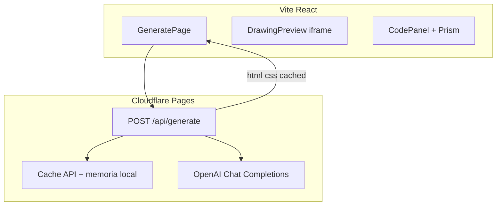

# Plan: Generador prompt → CSS (próxima iteración)

Documento de referencia para reimplementar el generador IA que se retiró temporalmente del proyecto. La galería sigue siendo el foco principal.

---

## Objetivo

Sección `/generar` donde el usuario escribe un prompt y obtiene:

- Vista previa del dibujo (HTML + CSS) en un iframe sandbox
- Código formateado con syntax highlight, copiable
- Sin llamar a OpenAI si el mismo prompt ya fue generado (caché)

---

## Arquitectura



**Hosting:** Cloudflare Pages (`dist`) + Pages Functions en `functions/api/generate.js`.

**Desarrollo local:**

```bash
npm run dev:cf
# concurrently: vite :5173 + wrangler pages dev --proxy 5173 :8788
# Abrir http://localhost:8788
```

`.dev.vars` con `OPENAI_API_KEY` (no commitear).

---

## Backend — `functions/api/generate.js`

### Contrato

```
POST /api/generate
Body: { "prompt": "un gato naranja estilo flat" }
→ 200: { "html": "...", "css": "...", "cached": false }
→ 200 cache hit: { ..., "cached": true }
→ 429 rate limit
→ 400/500 errores
```

### Variables de entorno

| Variable | Default | Descripción |
|----------|---------|-------------|
| `OPENAI_API_KEY` | — | Secret obligatorio |
| `OPENAI_MODEL` | `gpt-4o-mini` | Modelo barato |
| `MAX_TOKENS` | `2000` | Mapear a `max_completion_tokens` (no `max_tokens`) |
| `OPENAI_TEMPERATURE` | `0.5` | Más consistente que 0.7 |
| `RATE_LIMIT_PER_HOUR` | `10` | Por IP (`CF-Connecting-IP`) |
| `GENERATOR_ENABLED` | `true` | `false` apaga el endpoint |
| `CACHE_ENABLED` | `true` | `false` desactiva caché |
| `CACHE_TTL_SECONDS` | `604800` | 7 días |

### Caché (`functions/lib/cache.js`)

1. Normalizar prompt: `trim().toLowerCase().replace(/\s+/g, ' ')`
2. Clave: `SHA-256(modelo + "::" + prompt normalizado)`
3. Buscar en `caches.default` (Cloudflare Cache API)
4. Fallback: `Map` en memoria para dev local
5. **Cache hit:** no incrementar rate limit, no llamar OpenAI
6. Header respuesta: `X-Cache: HIT` | `MISS`

### System prompt (`functions/lib/prompts.js`)

Mantener un prompt estricto en archivo dedicado. Puntos clave que funcionaron/mejoraron calidad:

- Salida **solo JSON** con `html` y `css`
- Raíz obligatoria: `<div class="drawing">` — 280×280px, `overflow: hidden`
- Máximo ~12 hijos HTML; clases kebab-case semánticas
- Sin img, svg, script, url(), animaciones, media queries, CSS variables
- **z-index explícito** por capas (fondo → cuerpo → detalles → brillos)
- Unir piezas adyacentes sin huecos (tronco-copa, cabeza-cuerpo)
- Técnicas: `border-radius`, `clip-path`, gradients, `::before/::after`, `box-shadow` solo para sombras (no clonar formas)
- Paleta ≤4 colores + comentario `/* palette: ... */` al inicio del CSS
- Simplificar prompts complejos a icono cartoon reconocible
- `buildUserMessage(prompt)` separado del system prompt

> El último system prompt detallado estaba en inglés en `functions/lib/prompts.js` antes de retirar el feature; recuperarlo del historial de git si hace falta.

### Seguridad

- API key **solo** en servidor (Cloudflare Secrets / `.dev.vars`)
- Rate limit por IP
- Límite de gasto en [OpenAI Billing](https://platform.openai.com/settings/organization/billing/limits)
- Preview: `DOMPurify` + iframe `sandbox="allow-same-origin"` + `srcDoc` (`src/lib/sanitize.js`)
- Sin `dangerouslySetInnerHTML` en React root

---

## Frontend — archivos a recrear

| Archivo | Rol |
|---------|-----|
| `src/pages/GeneratePage.jsx` | Formulario, ejemplos de prompt, estado loading/error/caché |
| `src/components/generator/DrawingPreview.jsx` | iframe 320px, `min-w-0` en grid |
| `src/components/generator/CodePanel.jsx` | `js-beautify` + `react-syntax-highlighter` (Prism) |
| `src/lib/api.js` | `fetch('/api/generate')` |
| `src/lib/formatCode.js` | Formatear HTML/CSS antes de mostrar |
| `src/lib/sanitize.js` | `buildPreviewDocument`, whitelist tags |
| `src/App.jsx` | Ruta `/generar` con react-router |
| `src/components/layout/AppShell.jsx` | Link "Generar" en nav |
| `src/pages/GalleryPage.jsx` | CTA "Crear con IA" → `/generar` |

### Layout (lecciones aprendidas)

- Grid `lg:grid-cols-2` con **`min-w-0`** en columnas (evita iframe/pre de 16k px de ancho)
- iframe: altura fija `h-[320px]`, contenedor `overflow-hidden`
- Código: `wrapLongLines`, bloques HTML y CSS separados
- Badge UI si `result.cached === true`

---

## Dependencias npm a reañadir

```json
"dompurify": "^3.2.4",
"js-beautify": "^1.15.4",
"react-syntax-highlighter": "^15.6.1",
"react-router-dom": "^6.28.0"
```

Dev:

```json
"concurrently": "^9.1.2",
"wrangler": "^4.14.0"
```

Scripts:

```json
"dev:cf": "concurrently -k -n vite,wrangler \"vite --port 5173 --strictPort\" \"wrangler pages dev --proxy 5173 --port 8788\"",
"deploy": "npm run build && wrangler pages deploy dist"
```

`vite.config.js` — proxy `/api` → `http://localhost:8788`.

---

## Config Cloudflare

`wrangler.jsonc`:

```jsonc
{
  "name": "dibujarte-css",
  "compatibility_date": "2025-03-01",
  "pages_build_output_dir": "dist"
}
```

`public/_redirects` (SPA + API):

```
/assets/*  /assets/:splat  200
/api/*     /api/:splat     200
/*         /index.html     200
```

Secret en dashboard: `OPENAI_API_KEY`.

---

## Orden de implementación sugerido

1. Restaurar `functions/` (generate + lib/cache + lib/prompts)
2. Probar endpoint con `curl` / `wrangler pages dev`
3. UI mínima (prompt + preview sin highlight)
4. Sanitización iframe + formateo + Prism
5. Caché + badge "desde caché"
6. Ajustar system prompt según pruebas reales
7. README y `.env.example`

---

## Fuera de alcance (v1)

- Guardar generaciones en galería pública / DB
- Auth de usuarios
- RAG con ejemplos de la galería
- KV persistente para caché global (Cache API suele bastar)

---

## Checklist al reactivar

- [ ] `OPENAI_API_KEY` en Cloudflare Secrets
- [ ] Hard limit en cuenta OpenAI
- [ ] `max_completion_tokens` (no `max_tokens`) en fetch a OpenAI
- [ ] `npm run dev:cf` → probar mismo prompt 2 veces (2.ª = caché)
- [ ] Verificar que `/generar` no rompe layout en móvil
